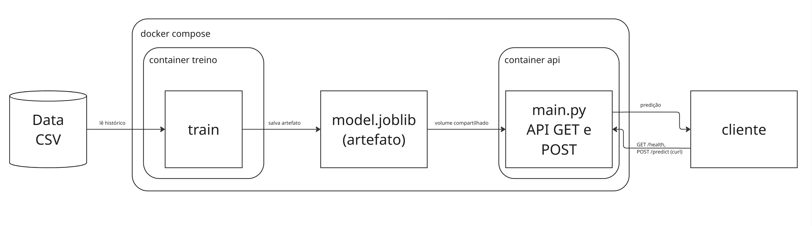
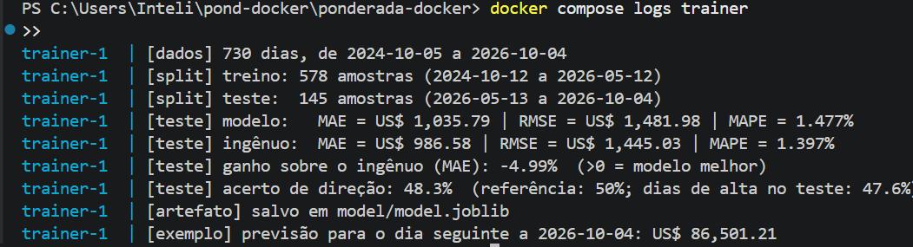
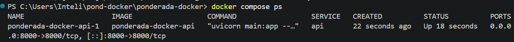
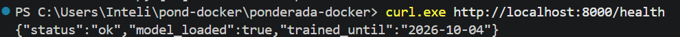
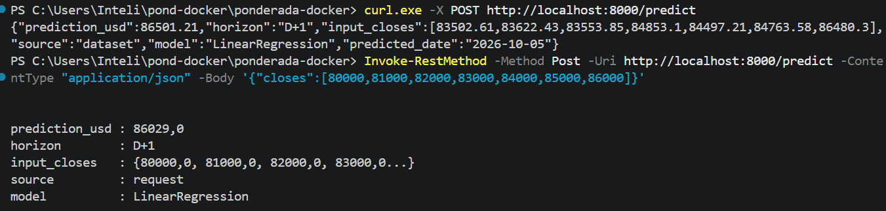

# Devlog — Predição do preço do Bitcoin com Docker

## Rafael Gomes Ferreira

---
## Registro do desenvolvimento

Com o diagrama UML feito partimos para o desenvolvimento. Por já ter estabelecido a estrutura, pra usar o Prophet conforme recomendado pelo professor era necessário alguns ajuste. Por falta de tempo decidi por prosseguir sem Prophet mesmo.

### Arquitetura

Para o esboço da arquitetura de forma mais simples e direta, optei por construir diretamente no Miro um diagrama de componentes que evidenciava claramente o fluxo da aplicação e interação com o usuário, além de deixar claro todos os componentes que fazem parte desse fluxo.

O container de treino grava model.joblib na pasta ./model, depois o container da API monta a mesma pasta como volume somente leitura e carrega o modelo quando inicia. Escolhi o volume em vez de copiar o modelo para a imagem (COPY) pra não precisar reconstruir a API todo treino.



### Dados

Para os dados foram pegos dados reais de BTC-USD baixados da API do Yahoo Finance, conforme indicado no readme.

### Modelo

Por questão de agilidade, em um primeiro momento decidi por utilizar regressão linear (scikit-learn) como modelo das predições

### Métricas

Pensando nas métricas apresentadas nas aulas de matemática, achei que seria interessantes usar elas para ter uma base de como nosso modelo se sai. A principal métrica erscolhida foi o MAE (Erro médio absoluto). A comparação aqui é do nosso modelo com o modelo NAIVE (ingênuo, que apenas pega o valor do período anterior e o considera como previsão para o próximo período), então utilizamos a seguinte forma: (1 − MAE do modelo / MAE do ingênuo) para medir o ganho do modelo sorbe o ingênuo.

| Métrica | Modelo | Ingênuo |
|---|---|---|
| MAE | US$ 1.035,79 | US$ 986,58 |
| RMSE | US$ 1.481,98 | US$ 1.445,03 |
| MAPE | 1,48% | 1,40% |
| Acerto de direção | 48,3% | — |
| **Ganho sobre o ingênuo** | **−4,99%** | — |

Ou seja, como principais limitções temos que nosso modelo ficou um pouco pior que o ingênuo e acertou a direção praticamente como uma moeda.

## Como reproduzir

```powershell
# 1. clonar o repositório  e abrir o Docker Desktop.
git clone https://github.com/gomes-raf/ponderada-docker.git
cd ponderada-docker

# 2. Treinar o modelo e subir a API
docker compose up --build -d

# 3. Ver o log do treino
docker compose logs trainer

# 4. Testar a API
curl.exe http://localhost:8000/health
curl.exe -X POST http://localhost:8000/predict

# 5. Encerrar
docker compose down
```

# Logs de comprovação de funcionamento

**Treino no container:** utiliza do comando para treinar o modelo



**Containers em execução:** ver quais container estão em execução



**API ativa:** mostra se o serviço esta ok ou não



**Predição:** esse print mostra a previsão ocorrendo de fato


